**Advanced Lane Finding Project**

The goals / steps of this project are the following:

* Compute the camera calibration matrix and distortion coefficients given a set of chessboard images.
* Apply a distortion correction to raw images.
* Use color transforms, gradients, etc., to create a thresholded binary image.
* Apply a perspective transform to rectify binary image ("birds-eye view").
* Detect lane pixels and fit to find the lane boundary.
* Determine the curvature of the lane and vehicle position with respect to center.
* Warp the detected lane boundaries back onto the original image.
* Output visual display of the lane boundaries and numerical estimation of lane curvature and vehicle position.

## [Rubric](https://review.udacity.com/#!/rubrics/571/view) Points
###Here I will consider the rubric points individually and describe how I addressed each point in my implementation.  

All the code is located in Processor folder.

###Video convertion.

In this project I decided to save all intermediate images, which was a hlp with debugging process. The first step for this project is to convert input video in a sequence of images, store those. And at the end assemble processed images in a video stream. Helper fuctions to work with video are in `Processor/video_converter.py`. I use `moviepy.editor` to help with video parsing.

###Camera Calibration

After we successfully converted the video into a  sequence of images, we need to remove distortion which was introduced by the camera. Helper functions are located in `Processor/camera_calibration.py`. Udacity provided a set of camera calibration images:  photos ofchess boards taken in different alngles. I use `cv2.findChessboardCorners` to find the location of the chess board corners, combine them with `objpoints` - expected coordinates of those points in a undistorted image, and generate callibration matrix with the help of `cv2.calibrateCamera`. I pass the obtained matrix into `cv2.undistort` function and undistort video images. Here is an example of how removing distortion works: we take one of the calibration images ( which is distorted), and apply undistirtion procedure. The result of this process is shown here.

###Pipeline (single images)

####1. Provide an example of a distortion-corrected image.
The same undistortion procedure we apply to every image we extract from the video stream. Here is an example of the original uand undistorted video images
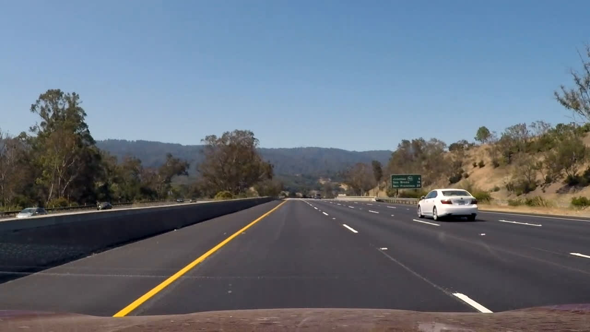
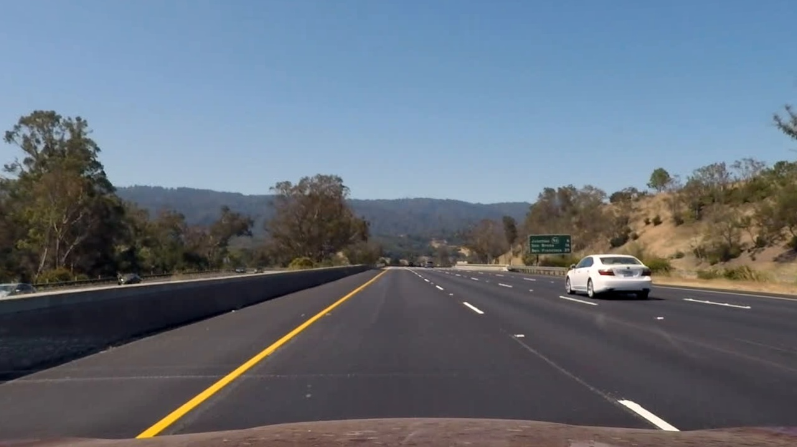
The changes are a bit suddle, look how the location of trees (closer to left and right side of the original image) changes in undistiorted image.

####3. Describe how (and identify where in your code) you performed a perspective transform and provide an example of a transformed image.

Perspective transform functions are located in `Processor/warper.py`. I use `cv2.getPerspectiveTransform` function to compute transformation matrix and `cv2.warpPerspective` to apply this transformation to every image. To construct a transformation matrix, I chose a video image where lanes visually parallel, e.g. Thus after perspective transform lanes should be (almost) parallel. 
.
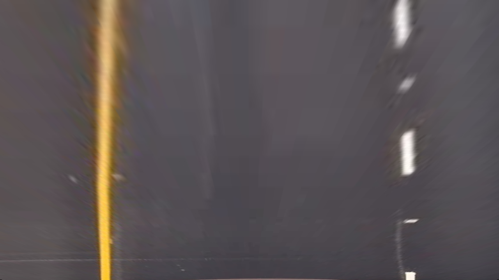
One important detail: perspective transform should not cut off lanes when the road is turning. After trial and error, i cam eup with the transform which preserves mostly lanes ( no extra objects), and preserves parallel lanes. Here I visualise the source mask.
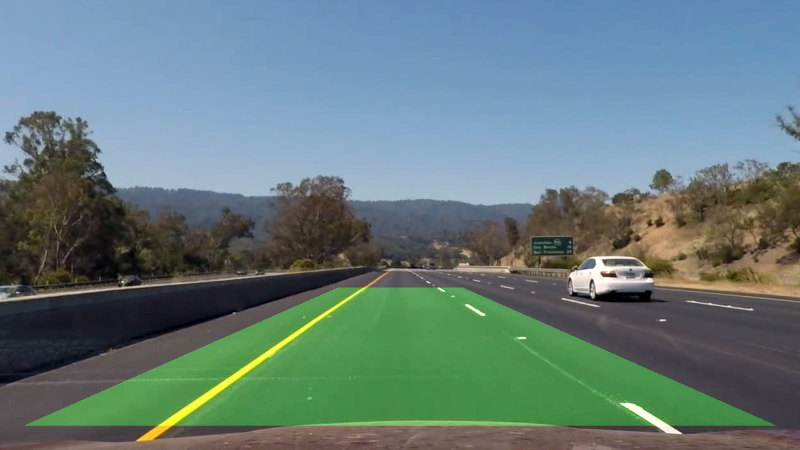

####2. Describe how (and identify where in your code) you used color transforms, gradients or other methods to create a thresholded binary image.  Provide an example of a binary image result.

I experimented with different methods and came up to the conclusion that there is no single best way color / gradient transform which does great in all conditions. For instance, lane detection by applying sobel threshold to S component of an image in HLS color space can perform worse than combining power of detecting yellow and white colors using color thresholding in HSV color space. Images in order: original, HLS(S), HSV(white), HSV(yellow).
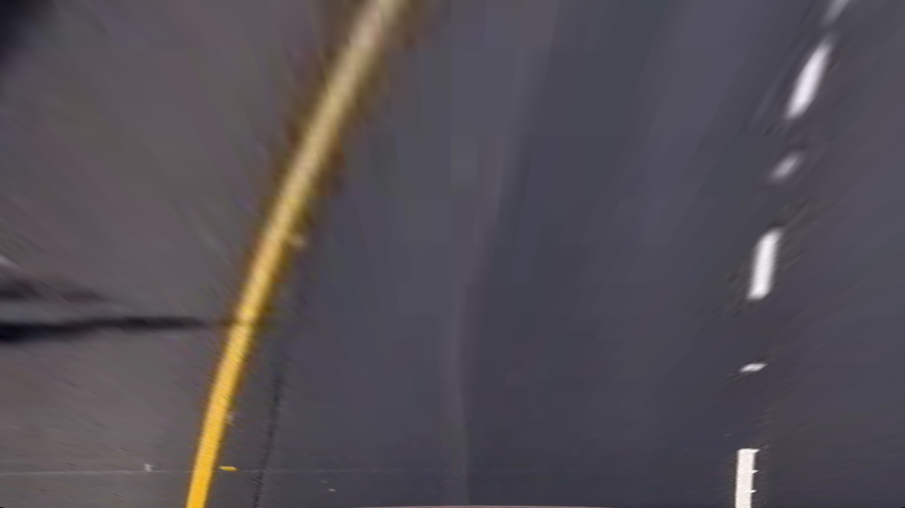
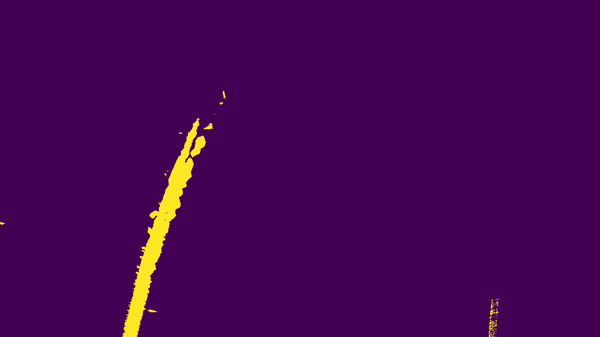
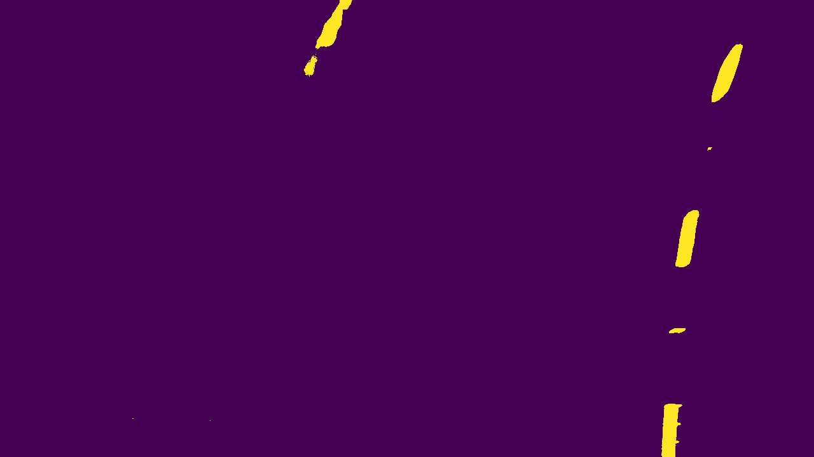
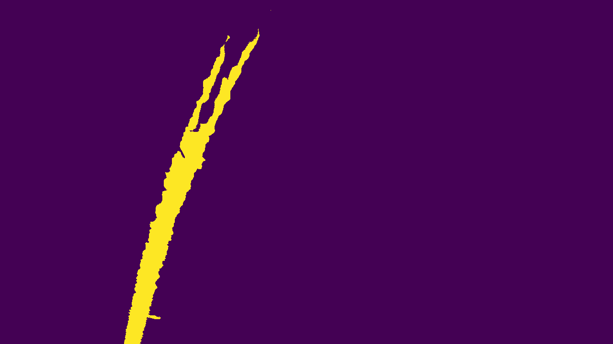

However, this is not always true. For some images, this is reverse. Detecting lanes in HSV color space can miserably fail
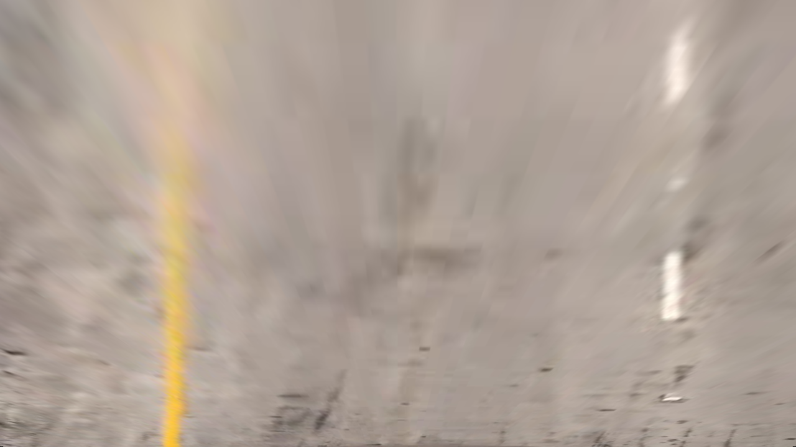
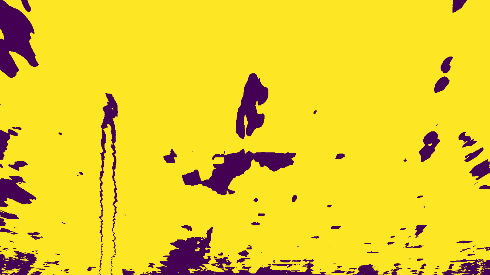
yet by applying thresholded sobel transform in HLS color space (L and S components), we are still capable of detecting lanes 
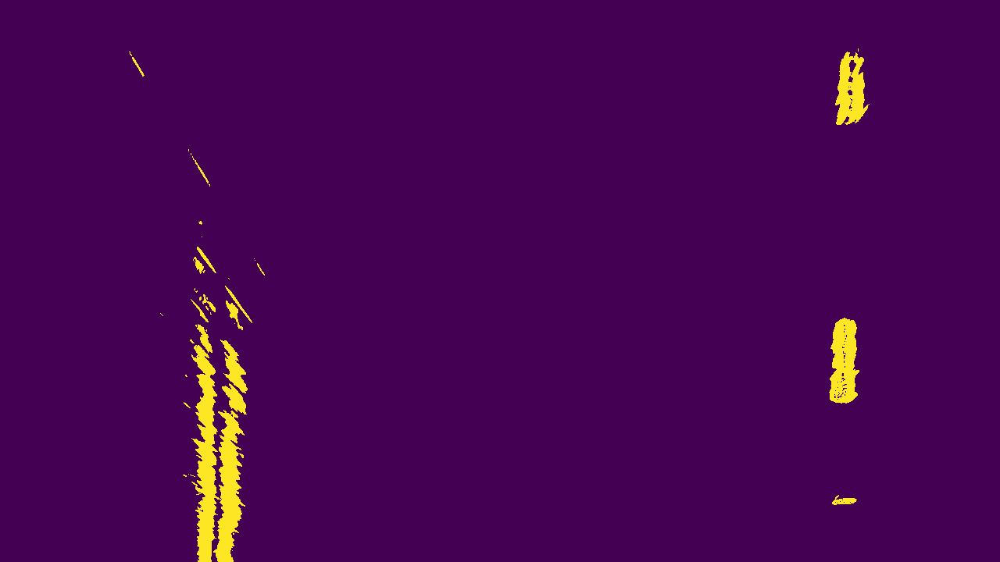.

My solution was to use both approaches. The code is located in `Processor/thresholder.py`. Here i filter yellow and white colors in HSV space, and apply sobel transforms in HLS space. Then in main pipeline `main.py` `lines 46-77` i implement failover logic: if lane aroximation coefficients are almost the same ( obtained using both methods), then I just average both predictions. Otheriwse failover to use sobel transform from HLS color space.

####4. Describe how (and identify where in your code) you identified lane-line pixels and fit their positions with a polynomial?

Lane detection routines are located in `Processor/lane_operations.py`. The pipeline for lane detection is the following. Take a binary image, compute initial estimage of lane locations ( sum of non zero points in the lower half of the image, put those sums on x axis, and smooth the results). Choose those peaks which are within certain location ( empirically estimated after runing over the images multiple times). These are your starting points in lane detection. From these two starting points we subsume other points if they are close enough to located lane locations. 

Proceed as follows:

1. compute the count of non-zero points along y axix for each point on x axix, 
2. smooth the results, 
3. locate all peaks which are within threshold to the previously found lane positions,
4. get all points which are within specified window
5. re-adjust lane location

At the end extract all binary image points and their locations, ( separately for each lane), and fit 2nd degree polynomial

The result of lane detection is shown in
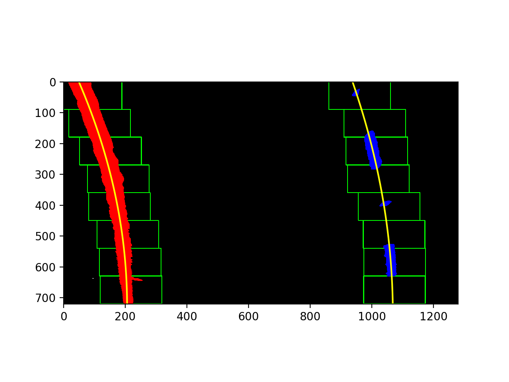.
Red and blue dots correspond to left and right lanes, green squares correspond to our iterations in updating lane location, and yellow lines represent approximated lates ( using those computed 2nd degree polynomials).

####5. Describe how (and identify where in your code) you calculated the radius of curvature of the lane and the position of the vehicle with respect to center.

According to wikipedia, in California highway width is 3.7 meters. On an image it is approximately 720 pixels between lanes. We compute the point where left and right lane intersects the bottom of the image, compute the middle of the lane, and the deviation in pixels between that and the middle of the image. Car camera is located in the center of the car, thus lane center should be in the middle of the image, and the difference correspond to deviation from the lane center. The code is located in `Processor/main.py` `lines 106 - 109`. 

To compute lane curvature, I adopted the approach from `http://www.intmath.com/applications-differentiation/8-radius-curvature.php`. The code is located in `Processor/lane_operations.py`, method `get_curvature`

####6. Provide an example image of your result plotted back down onto the road such that the lane area is identified clearly.

###Pipeline (video)

####1. Provide a link to your final video output.  Your pipeline should perform reasonably well on the entire project video (wobbly lines are ok but no catastrophic failures that would cause the car to drive off the road!).

Here is is: 

!video[ output_video.mp4 ]( ./output_video.mp4 )

![ output_video.mp4 ] ( ./output_video.mp4 )

---

###Discussion

If I would think of one biggest improvement i can make to this project is the decision logick how to combine results from multiple lane detection methods to improve the algorithm under poor lane visibility conditions. There were two stretches of poor lane visibility in the video ( on highway 280 I assume). However those stretches were relatively short, and a simple rule like re-use previously computed lane coefficients works. However 405 highway in los angeles has really bad yellow lane markins which are practically invisible in rain. Those stretches of poor visibility are pretty long. I cannot use the same logick in those conditions. Something like SLAM (simultaneous localisation and mapping ) comes in mind which could have helped in conditions like those. We would need to memorise the position of last a few clearly seen marking an try to extrapolate our location according to those markings. As well as our location towards other cars : essentially use other cars on the road as helpers to identify where lanes are located when those lanes are not visible.
