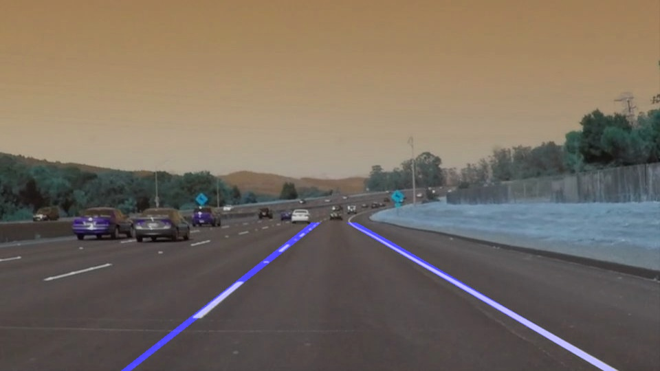
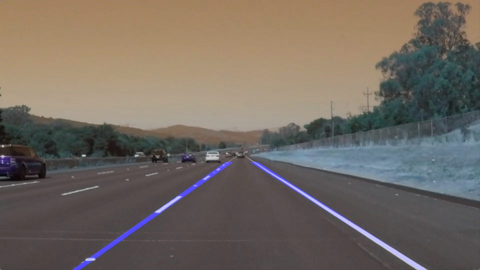
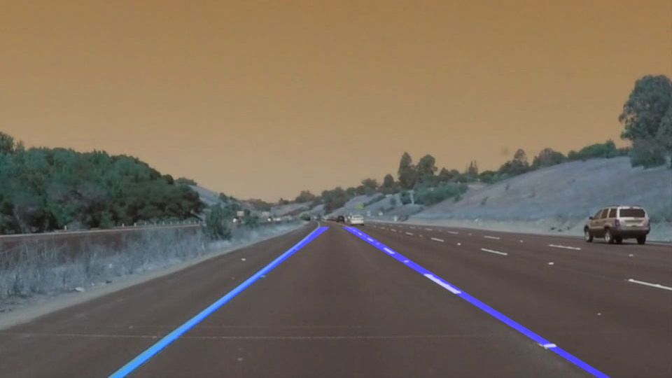
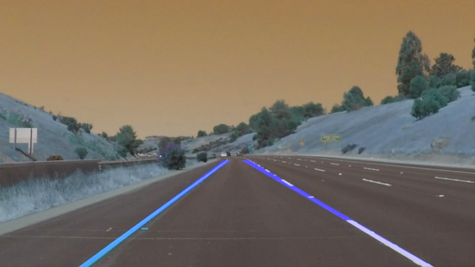
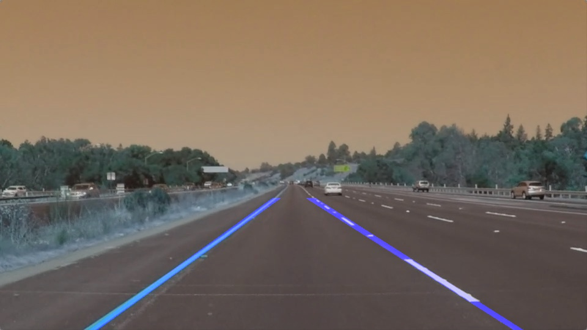
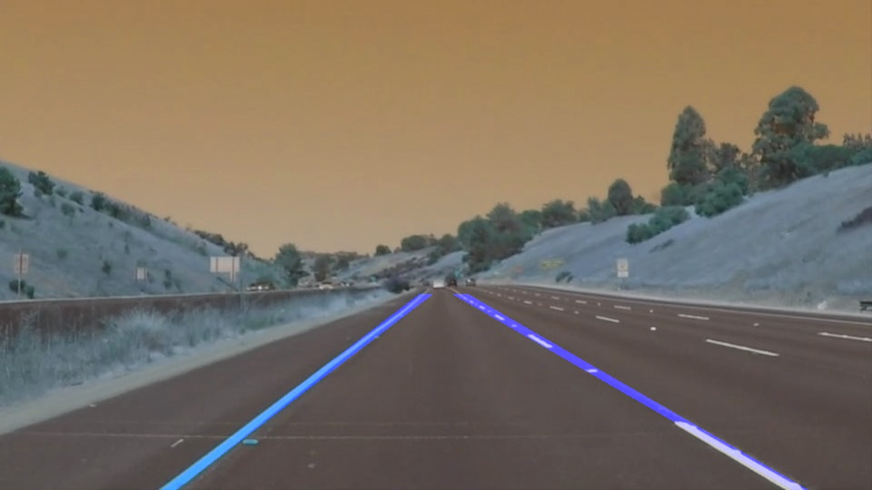

# Finding Lane Lines on the Road

## Udacity Self Driving Car Engineer: Finding Lane Lines on the Road project: overview
The lines on the road show us where the lanes are. They act as our 
 constant reference for where to steer the vehicle.  One 
 of the first things we would like to do in developing a self-driving car 
 is to automatically detect lane lines using an algorithm.

In this project we are using opencv + python to perform the following steps:
* convert the original image into its grey-scale representation
* apply canny edge detection to the obtained grey-scale image
* define area of interest on the image to filter out areas where 
we expect to detect highway lanes. we assume that images are obtained from a 
front-facing camera located in the middle of the dash board. The car will be
 driving approximately in the middle of the lane
* apply Hough Line Transform to the masked area of interest , and detect lanes
* finally apply approximation on top of detected lanes
 to minimize jittering in the detection algorithm 

### Results
At first we will demonstrate how algorithm performs on static images.
This is a necessary tuning step before we apply this transform to a video.

Original image             |  Lane detection
:-------------------------:|:-------------------------:
  |  
  | 
 | 
 | 
 | 
 | 

Once we are happy with the accuracy of lane detection on still images, we will apply
the same procedure to detect lanes on a video.

Original video             |  Lane detection video
:-------------------------:|:-------------------------:
 | 
  | 

### Parameter tuning
Parameters for this project were tuned manually, stage by stage:
* at first, i tuned parameters for canny edge detection, making sure that all 
important lines are detected, however not too many lines are detected either
* second stage was to find a proper image mask, which I accomplished by experimenting
 with images extracted from the video, and making sure that I am not cropping 
 any important part of the lane
* third step was to tune Hough Line transform parameteres, using visual guidance: 
making sure we are left only with points which correspond to lane lines