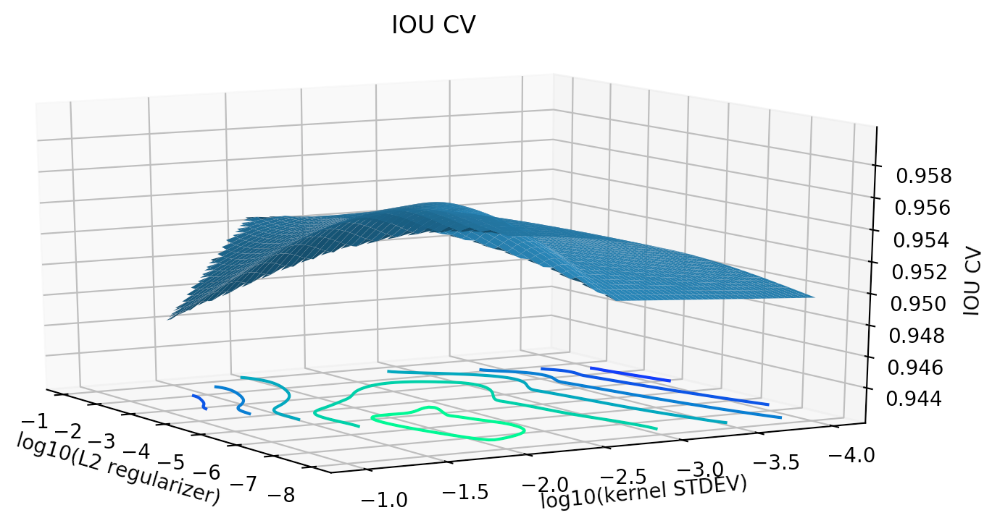
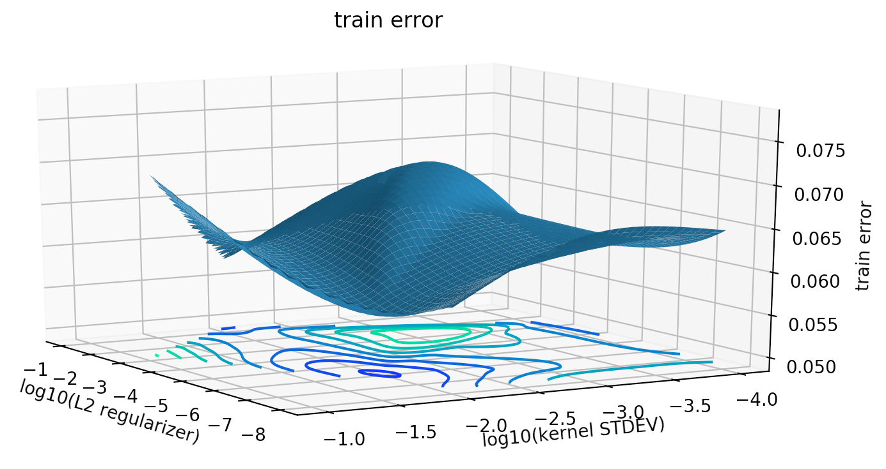
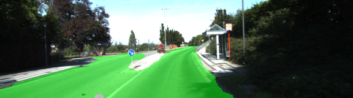
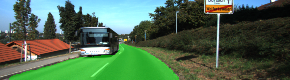
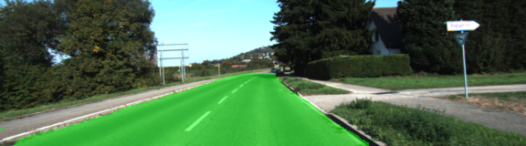
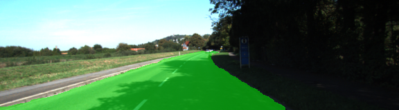
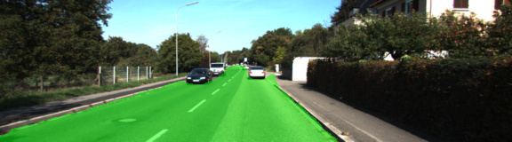
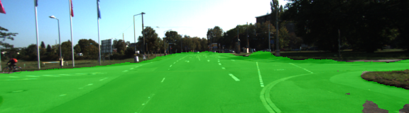

# Semantic Segmentation
### Udacity Self Driving Car Engineer Semantic Segmentation project: overview
The goals for this project are:
 * to build fully convolutional neural network (FCNN) in Tensorflow using VGG16 network pre-trained on ImageNet as an encoder
 * train this network using labeled data coming from a front facing camera on a car; data 
 will come in pairs : street view and labels marking road / non-road pixels
 * apply trained model to detect and mark pixels corresponding to road on 
 previously unseen images
 #### Results
 KITTI road segmentation results, split into two distinct movie stories
 
 
#### Content of the repository
* `environment.yml` - a modified conda env specifications
* `main.py` - implementation of FCN, optimization and training functions, as well as 
training and cross-validation routines
* `helper.py` - all the necessary functions to download the encoder model and the 
training data, perform batch splitting and augment input data and labels
* `project_tests.py` - necessary tests for FNCC
* `plotting.py` - utility to visualize training / CV error space and 
help find optimal parameters for the FCNN
* `semantic_segmentation_kitti.mp4` - resulting video

#### Architecture

A Fully Convolutional Network 
[FCN-8](https://people.eecs.berkeley.edu/%7Ejonlong/long_shelhamer_fcn.pdf) 
was applied for the project. It uses VGG16 pretrained on ImageNet as an encoder. Decoder is used to upsample features, extracted by the VGG16 model, to the original image size. The decoder is based on transposed convolution layers.

The goal is to assign each pixel of the input image to the appropriate class
 (road, backgroung, etc). So, it is a classification problem, that is why, 
 cross entropy loss was applied as training metric and was minimized 
 via Adam optimizer in `main.py lines 133-142`.
 

##### Dataset
For this project I used [Kitti Road dataset](http://www.cvlibs.net/datasets/kitti/eval_road.php) available from [here](http://www.cvlibs.net/download.php?file=data_road.zip).  Extract the dataset in the `data` folder.  This will create the folder `data_road` with all the training a test images.
I have modified `helper.py` by adding `maybe_download_kitti` function which will
check if the data set was already downloaded, otherwise will download it for us.

##### Image augmentation
The original KITTI data set contains 289 images and their corresponding labels, 
I artificially increase the size of the training set by applying a series of 
transformations to the original images and corresponding labels.
Augmentation ideas were inspired after reading about [imgaug library](https://github.com/aleju/imgaug)
and implemented in `helper.py lines 19-43, 153-155, 164-165`. Augmentation provides us with virtually unlimited
non-overlapping training data

```Python
augmentation_seq = iaa.Sequential([
    iaa.Crop(px=(0, 30), name="Cropper"),  # crop images from each side by 0 to 30px (randomly chosen)
    iaa.Fliplr(0.5, name="Flipper"),
    # iaa.GaussianBlur((0, 1.0), name="GaussianBlur"),
    iaa.Add((-10, 10), name="Brighness"),
    iaa.ContrastNormalization((0.5, 2.0), name="Contrast"),
    iaa.AdditiveGaussianNoise(scale=0.01 * 255, name="GaussianNoise"),
    iaa.Affine(translate_px={"x": (-30, 30), "y": (-30, 30)},
               shear=(-20, 20),
               rotate=(-10, 10),
               name="Affine")
])
```
##### Cross validation
Image augmentation also provides us with a set of (image, labels) on which we can
verify how good the model will perform on images which we have not yet presented
for training and can be used for objective parameter tuning for the FCNN. For 
cross-validation purposes i use intersection over union metrics implemented in
`main.py lines 188-208`

##### Parameter tuning
In this project I was trying to optimize / set the following parameters:
* number of epochs
* mini-batch size
* learning rate
* L2 regularizer for CNN
* STDEV for kernel initializer for CNN

I was able to use `g3.4xlarge` AWS node which was capable to handle mini-batch
size of 16. However I would be getting errors from time to time associated with 
memory allocation amount. Altimately i tried 2 values: 16 and 5. With `5` i achieved
faster error convergence and thus chose it.

I tried number of epochs up to 100, howver notised pretty much saturation in error
reduction and IOU at ~ `40` epochs.

For learning rate selection i started with small values for L2 and STDEV ( e.g. `1e-3`), and 
tried different values for the learning rate, while looking how the training error 
is decreasing, and if there is any saturation or oscillations. A good enough value 
was `0.5e-4`.

To get optimal values for `L2` and `STDEV` i pertubed their values around my 
initial guess and plotted the obtained results. Based on the parameter space covered
the values were chosen: `L2 = 1e-6`, `STDEV = 1e-2`

 
 
 
##### Video generation
Once the model was trained, and test images labeled, I am generating
 a video in `main.py lines 249-252`

#### Test images labeling quality
There was no labels available for the test images, thus we can only visually
examine the obtained results. I have attached a a few labeled test images which 
demonstrate different situations observed:
* complex road intersections
* roads with and without other cars / buses
* one  / multiple cars on the road
* shadows thrown on the road
* road / sidewalk


 
 
 
 
 
 
 
 For the most part, FCNN did a very good job with test image segmentation.